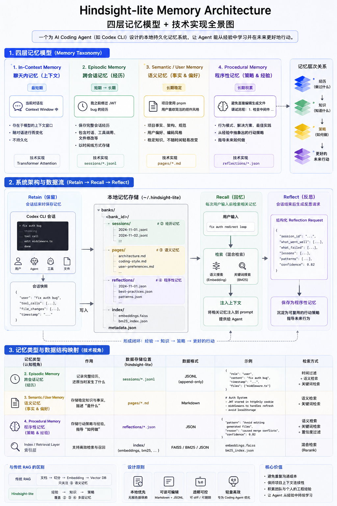
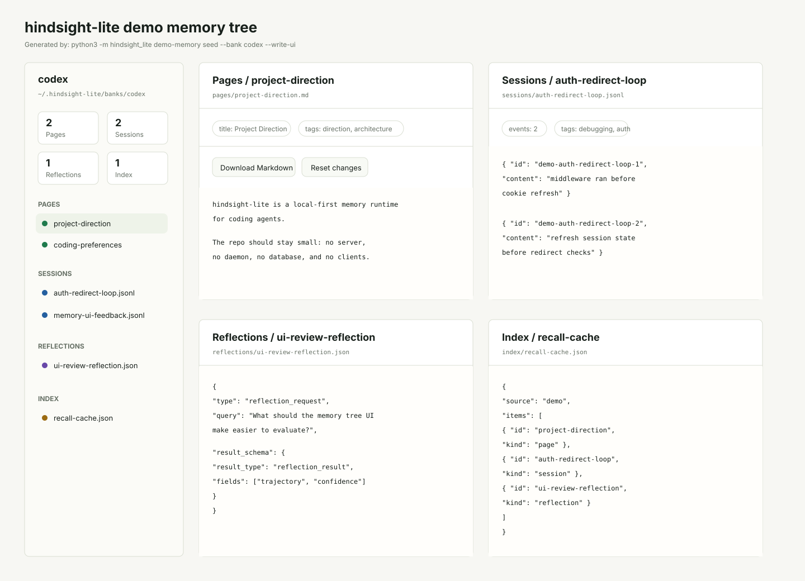

<h1 align="center">
  hindsight-lite
</h1>

<p align="center">
  <strong>Local-first memory for AI coding agents.</strong>
</p>

<p align="center">
  <a href="https://github.com/lihan0705/hindsight-lite"></a>
  <a href="https://github.com/lihan0705/hindsight-lite"></a>
  <a href="https://github.com/lihan0705/hindsight-lite"></a>
  <a href="https://github.com/lihan0705/hindsight-lite"></a>
  
  
  
</p>

<p align="center">
  <code>#agent-memory</code>
  <code>#codex</code>
  <code>#local-first</code>
  <code>#markdown-jsonl</code>
  <code>#rl-ready</code>
</p>

> This project is a subtractive fork of
> [vectorize-io/hindsight](https://github.com/vectorize-io/hindsight).
> The upstream README is preserved at
> [docs/upstream/HINDSIGHT_README.md](docs/upstream/HINDSIGHT_README.md).

hindsight-lite keeps the agent memory workflow and removes the heavy product
surface: no server, no daemon, no database, no cloud dependency, and no control
plane UI.

The first target is Codex CLI. The V1 design stores memory locally as editable
Markdown and JSONL files, then injects only compact, relevant memory through the
existing Codex hook mechanism.

```text
Store locally. Recall narrowly. Reflect for future training data.
```

## Memory Architecture



---

## Why This Fork?

Upstream Hindsight is a full memory platform with an API server, database,
control plane, SDKs, Docker/Helm deployment, and many framework integrations.

hindsight-lite is the subtractive version for coding agents:

- local files instead of hosted infrastructure,
- Codex hooks instead of a memory server,
- Markdown pages and JSONL sessions instead of PostgreSQL,
- explicit reflection packets instead of hidden model calls,
- a small plugin surface before broader multi-agent support.

The goal is not to reproduce every upstream feature. The goal is to keep the
parts that help an agent remember project work and remove the parts that make a
local plugin hard to install, inspect, or reason about.

---

## Codex-First V1

The V1 scope is intentionally small.

| Capability | Status | Mechanism |
|---|---:|---|
| `agent_knowledge_retain` | alpha | Codex `Stop` hook writes session JSONL |
| `agent_knowledge_recall` | alpha | Codex `UserPromptSubmit` injects compact context |
| `agent_knowledge_reflect` | alpha | local recall packet plus saved reflection request |
| file context recall | alpha | Codex `PreToolUse` injects compact context before file reads |
| `agent_knowledge_list_pages` | alpha | lists local Markdown pages |
| `agent_knowledge_get_page` | alpha | reads one local Markdown page |
| `agent_knowledge_import_codex_memory` | alpha | imports Codex memory files as local pages |

The `python3 -m hindsight_lite` CLI exposes these `agent_knowledge_*` command
names for parity with the documented V1 surface. Short local-debug commands are
also available.

The existing Codex integration already has the right hook shape:

```text
SessionStart      -> codex_hook.py -> session_start.py
UserPromptSubmit  -> codex_hook.py -> recall.py
PreToolUse        -> codex_hook.py -> file_context.py
Stop              -> codex_hook.py -> retain.py
```

hindsight-lite keeps that contract and replaces the backend:

```text
old:
  Codex hook -> recall.py / retain.py -> daemon/API client -> Hindsight server

new:
  Codex hook -> codex_hook.py -> local Python core -> Markdown/JSONL
```

For installation and smoke-test commands, see the
[Codex quickstart](hindsight-integrations/codex/README.md#quickstart).

---

## Memory Files

Default local memory root:

```text
~/.hindsight-lite/
```

Bank layout:

```text
~/.hindsight-lite/
  banks/
    <bank_id>/
      sessions/
        <session_id>.jsonl
      pages/
        <page_id>.md
      reflections/
        <reflection_id>.json
      index/
        recall-cache.json
      metadata.json
```

V1 memory types:

- `sessions/*.jsonl` stores retained Codex conversation snapshots.
- `pages/*.md` stores user-readable knowledge pages.
- `reflections/*.json` stores reflection requests for later analysis.

This keeps memory readable, diffable, scriptable, and easy to delete.

Existing Codex memory files can be imported into `pages/*.md` without changing
the Codex-owned source files:

```bash
python3 -m hindsight_lite codex-memory import --bank codex
```

By default this reads `~/.codex/memories`. Use `--source-dir` to point at a
different Codex memory export or fixture directory.

Generate a local memory tree inspector:

```bash
python3 -m hindsight_lite memory-ui --bank codex
```

The command writes `memory-tree.html` inside the selected bank directory. It is
a static page for inspecting `pages`, `sessions`, `reflections`, and `index`
files without starting a server. Markdown pages can be edited in the browser and
downloaded as complete `.md` files with their frontmatter preserved.



For a more convincing local demo, seed five representative history items across
pages, sessions, reflections, and index files:

```bash
python3 -m hindsight_lite demo-memory seed --bank codex --write-ui
```

The command refuses to overwrite existing demo files unless `--overwrite` is
provided.

---

## Recall Injection

Codex recall remains automatic.

Before each user prompt, `recall.py` reads the hook input, derives the bank,
runs local text retrieval over sessions and pages, and emits:

```json
{
  "hookSpecificOutput": {
    "hookEventName": "UserPromptSubmit",
    "additionalContext": "<hindsight_lite_memories>...</hindsight_lite_memories>"
  }
}
```

Codex injects `additionalContext` into the current turn. Retain strips
`<hindsight_lite_memories>` and legacy `<hindsight_memories>` blocks before
writing session memory, which prevents memory feedback loops.

File context recall is also automatic. Before file-reading tools run,
`file_context.py` extracts the target path, recalls compact local memory for
that path, and emits a small `<hindsight_lite_file_context>` block. This follows
the same conservative rule as prompt recall: inject only excerpts and IDs, not
full historical transcripts.

Recall scoring is intentionally lightweight and local. It uses body text plus
titles, tags, metadata, and session identifiers, then excerpts near matching
query terms so injected context stays small and relevant.

---

## Reflection For Agentic RL Data

`agent_knowledge_reflect` is a data boundary, not an LLM wrapper.

It does not call a model. It performs local recall, builds a structured packet,
and saves a `reflection_request` event:

```json
{
  "type": "reflection_request",
  "query": "What should we remember about this repo?",
  "retrieved_context": [],
  "task_context": {
    "cwd": "/path/to/project",
    "git_commit": "abcdef",
    "recent_prompt": "..."
  },
  "reflection_prompt": "Use the retrieved evidence to produce a concise decision-oriented reflection...",
  "result_schema": {
    "version": "1.0",
    "result_type": "reflection_result",
    "fields": [
      {
        "name": "trajectory",
        "value_type": "object",
        "description": "State, action, observation, outcome, and lesson."
      },
      {
        "name": "confidence",
        "value_type": "number",
        "description": "Confidence score from 0.0 to 1.0."
      }
    ]
  }
}
```

That shape is meant to support future agentic RL datasets:

```text
state/context -> retrieved memory -> reflection request -> later agent action
```

V1 records reflection requests only, but each request now carries the stable
result schema expected from a later evaluator or reflection agent. The result
shape separates `trajectory` evidence, promotable facts, reusable procedures,
uncertain items, and a confidence score.

Evaluator or human-reviewed outputs can be written back as explicit
`reflection_result` JSON files:

```bash
python3 -m hindsight_lite reflection-result write --bank codex --file result.json
```

The command validates the result shape and stores it under `reflections/` next
to the request packet, keeping future eval/RL artifacts local and inspectable.

---

## Contributing

This fork uses a subtraction-first workflow. Before opening a merge request or
pull request, read the agent-friendly contribution guide:

[docs/agent-contribution-guide.md](docs/agent-contribution-guide.md)

It covers branch checkout, commits, verification, MR/PR preparation, and the
rules agents should follow when editing this repository.

---

## Original Hindsight

This repository started from upstream Hindsight:

- Upstream repository:
  [vectorize-io/hindsight](https://github.com/vectorize-io/hindsight)
- Preserved upstream README:
  [docs/upstream/HINDSIGHT_README.md](docs/upstream/HINDSIGHT_README.md)

The upstream project remains the reference for the original full-stack memory
platform. hindsight-lite is the local plugin fork.

---

## License

MIT
