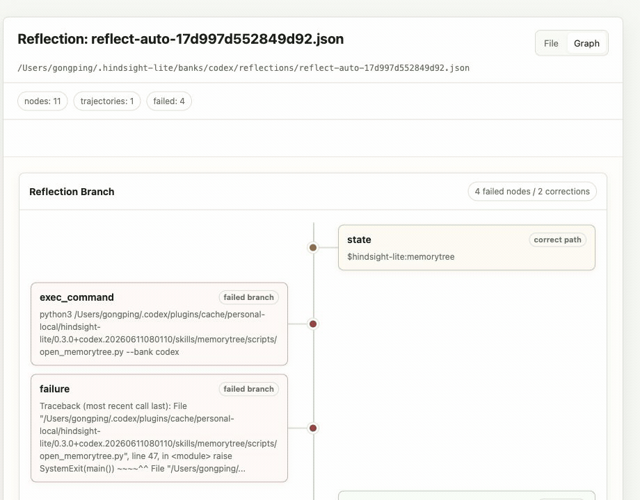
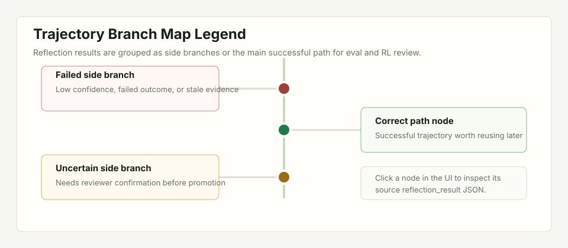

<h1 align="center">
  hindsight-lite
</h1>

<p align="center">
  <strong>Local-first memory for AI coding agents.</strong>
</p>

<p align="center">
  <a href="https://github.com/lihan0705/hindsight-lite"></a>
  <a href="https://github.com/lihan0705/hindsight-lite"></a>
  <a href="https://github.com/lihan0705/hindsight-lite"></a>
  <a href="https://github.com/lihan0705/hindsight-lite"></a>
  
  
  
</p>

<p align="center">
  <code>#agent-memory</code>
  <code>#codex</code>
  <code>#local-first</code>
  <code>#markdown-jsonl</code>
  <code>#rl-ready</code>
</p>

hindsight-lite is a subtractive fork of
[vectorize-io/hindsight](https://github.com/vectorize-io/hindsight), built for
local coding agents rather than a hosted memory platform. It stores memory as
editable Markdown, JSONL, and JSON files, then injects only compact relevant
context through Codex hooks. The original upstream README is preserved at
[docs/upstream/HINDSIGHT_README.md](docs/upstream/HINDSIGHT_README.md).

```text
Store locally. Recall narrowly. Reflect for future training data.
```

## Install With Codex CLI

Requirements: Codex CLI with plugin support and Python 3.11+.

```bash
codex plugin marketplace add lihan0705/hindsight-lite --ref main
codex plugin add hindsight-lite@hindsight-lite
```

Restart Codex and open a new thread so the hooks and bundled `memorytree` skill
are loaded. End one short conversation, start another, and ask about something
from the first conversation to verify cross-session recall. To inspect the
local files visually, run `$memorytree` or select **Memory Tree** from
`/skills`.

Use either the plugin installation above or the legacy manual hook setup, not
both. If `~/.codex/hooks.json` already contains hindsight-lite commands from an
older manual installation, remove those entries before enabling the plugin.
Otherwise every lifecycle event can run twice and Codex can print duplicate
hook output or failures.

To update an existing installation:

```bash
codex plugin marketplace upgrade hindsight-lite
codex plugin remove hindsight-lite@hindsight-lite
codex plugin add hindsight-lite@hindsight-lite
```

Restart Codex and open a new thread after updating. Memory remains under
`~/.hindsight-lite/` when the plugin is updated or removed. The
[Codex integration guide](hindsight-integrations/codex/README.md) contains the
manual hook setup, WSL notes, configuration, and troubleshooting details.

## How It Works

hindsight-lite follows a small local loop:

```text
conversation
    |
    v
Retain  -> sessions/*.jsonl + pages/*.md
    |
    v
Recall  -> compact relevant excerpts -> next Codex prompt
    |
    v
Reflect -> reviewable failure/correction trajectory -> reflections/*.json
```

Codex lifecycle hooks connect that loop to the local runtime:

| Hook | Local action |
|---|---|
| `SessionStart` | Initialize the selected memory bank |
| `UserPromptSubmit` | Recall relevant pages and sessions, then inject a compact context block |
| `PreToolUse` | Recall file-specific context before supported file reads |
| `Stop` | Replace the latest session snapshot, promote durable profile facts, refresh the UI, and extract a reflection candidate when appropriate |

Every event enters the same dispatcher, which routes it to one focused Python
handler:

```text
SessionStart      -> codex_hook.py -> session_start.py
UserPromptSubmit  -> codex_hook.py -> recall.py
PreToolUse        -> codex_hook.py -> file_context.py
Stop              -> codex_hook.py -> retain.py
```

`SessionStart` runs when a Codex thread starts, `UserPromptSubmit` runs before
each user prompt is processed, and `PreToolUse` runs before matching tool
calls. `Stop` runs after each completed agent turn, not only when Codex exits;
with the default `retainEveryNTurns: 1`, that means Retain runs after every
turn.

The three stages deliberately have different responsibilities:

- **Retain** preserves evidence. Sessions remain an audit-style record, while
  stable user or project knowledge can be promoted into editable pages.
- **Recall** ranks local text and returns short excerpts rather than replaying
  full transcripts. A local BM25 index avoids reparsing every memory file on
  each prompt, reducing latency, prompt noise, and token use.
- **Reflect** records the latest completed failure-to-recovery episode for
  review. It does not silently turn heuristics into training labels.

All runtime state stays under `~/.hindsight-lite/`. There is no API server,
daemon, database, control plane, or required model call.


## Hindsight And hindsight-lite

Both projects use the Retain, Recall, and Reflect vocabulary, but they make
different engineering tradeoffs.

| Area | Hindsight | hindsight-lite |
|---|---|---|
| Primary use | General agent memory platform | Local memory plugin for coding agents |
| Runtime | API service backed by PostgreSQL and vector infrastructure | In-process Python called by Codex hooks |
| Retain | LLM-assisted extraction and normalization into facts, entities, relationships, and temporal information | Store local session evidence and promote selected facts into Markdown pages |
| Recall | Semantic, keyword, graph, and temporal retrieval with fusion and reranking | Lightweight local lexical scoring with compact excerpt budgets |
| Reflect | Agentic multi-step reasoning over facts, observations, and mental models | Explicit request packets and deterministic corrected-episode candidates for later human or evaluator review |
| Inspection | Server APIs, SDKs, and platform tooling | Files plus a generated editable MemoryTree UI |
| Operational cost | More capable, with more infrastructure and model work | Smaller, transparent, offline-friendly, and easy to delete or diff |

Upstream Hindsight is the reference when the goal is semantic consolidation,
graph and temporal retrieval, or autonomous reflection. hindsight-lite borrows
the memory lifecycle while keeping evidence visible and the runtime small. See
the upstream [repository](https://github.com/vectorize-io/hindsight),
[Reflect documentation](https://hindsight.vectorize.io/developer/reflect), and
[Observations documentation](https://hindsight.vectorize.io/developer/observations)
for the full design.

---

## Codex-First V1

The V1 scope is intentionally small.

| Capability | Status | Mechanism |
|---|---:|---|
| `agent_knowledge_retain` | alpha | Codex `Stop` hook writes session JSONL |
| `agent_knowledge_recall` | alpha | Codex `UserPromptSubmit` injects compact context |
| `agent_knowledge_reflect` | alpha | local recall packet plus saved reflection request |
| file context recall | alpha | Codex `PreToolUse` injects compact context before file reads |
| `agent_knowledge_list_pages` | alpha | lists local Markdown pages |
| `agent_knowledge_get_page` | alpha | reads one local Markdown page |
| `agent_knowledge_import_codex_memory` | alpha | imports Codex memory files as local pages |

The `python3 -m hindsight_lite` CLI exposes these `agent_knowledge_*` command
names for parity with the documented V1 surface. Short local-debug commands are
also available.

For runtime smoke-test commands, see the
[Codex integration quickstart](hindsight-integrations/codex/README.md#quickstart).

---

## Memory Files

Default local memory layout:

```text
~/.hindsight-lite/
  banks/
    <bank_id>/
      sessions/
        <session_id>.jsonl
      pages/
        <page_id>.md
      reflections/
        <reflection_id>.json
      index/
        recall-index.json
      metadata.json
```

V1 memory types:

- `sessions/*.jsonl` stores the latest full-session snapshot, or append-only
  windows when chunked retention is enabled.
- `pages/*.md` stores user-readable knowledge pages.
- `reflections/*.json` stores reflection requests for later analysis.
- `index/recall-index.json` stores a rebuildable BM25 search index over pages
  and sessions. It is derived data, not a memory source.

This keeps memory readable, diffable, scriptable, and easy to delete.

Recall creates the index on first use. Runtime page and session writes update
an existing index incrementally; direct file edits are detected from source
metadata and cause the next Recall to rebuild it. Deleting the index does not
delete memory. To inspect or rebuild it manually:

```bash
python3 -m hindsight_lite index status --bank codex
python3 -m hindsight_lite index rebuild --bank codex
```

Existing Codex memory files can be imported into `pages/*.md` without changing
the Codex-owned source files:

```bash
python3 -m hindsight_lite codex-memory import --bank codex
```

By default this reads `~/.codex/memories`. Use `--source-dir` to point at a
different Codex memory export or fixture directory.

## MemoryTree UI

The installed plugin includes the `memorytree` skill. Start a new Codex thread
and run:

```text
$memorytree
```

You can also use `/skills` and select **Memory Tree**. Codex does not currently
allow third-party plugins to register a top-level `/memorytree` command.

The skill starts the editable local UI. The equivalent CLI command is:

```bash
python3 -m hindsight_lite memory-ui --bank codex --serve --open
```

The command starts a local editor, prints its HTTP URL, and opens it in the
platform browser. It binds to `127.0.0.1` normally. Under WSL it binds to the
distro's private IPv4 so the Windows browser can still connect when localhost
forwarding is disabled. This avoids WSL UNC file paths. Existing Markdown pages
can be edited and saved back to `pages/*.md`; sessions, reflections, and index
files remain read-only. Use `--host` only when a custom bind address is needed.

For a server-free snapshot, omit `--serve`:

```bash
python3 -m hindsight_lite memory-ui --bank codex --open
```

This writes `memory-tree.html` inside the selected bank directory. The static
page can inspect all memory types and download edited Markdown, but browsers
cannot save those edits directly back to disk. The Stop hook refreshes this
snapshot after each successful retain.

Sessions are rendered as readable event summaries rather than raw JSONL.
Reflection request/result files expose links, confidence, lesson previews, and
a deterministic trajectory graph. Failed or uncertain samples split into side
branches, while successful samples stay on the main path.






For a more convincing local demo, seed representative history items across
pages, sessions, reflections, trajectory results, and index files:

```bash
python3 -m hindsight_lite demo-memory seed --bank codex --write-ui
```

The command refuses to overwrite existing demo files unless `--overwrite` is
provided.

---

## Recall Injection

Codex recall remains automatic.

Before each user prompt, `recall.py` reads the hook input, derives the bank,
runs local text retrieval over sessions and pages, and emits:

```json
{
  "hookSpecificOutput": {
    "hookEventName": "UserPromptSubmit",
    "additionalContext": "<hindsight_lite_memories>...</hindsight_lite_memories>"
  }
}
```

Codex injects `additionalContext` into the current turn. Retain strips
`<hindsight_lite_memories>` and legacy `<hindsight_memories>` blocks before
writing session memory, which prevents memory feedback loops.

File context recall is also automatic. Before file-reading tools run,
`file_context.py` extracts the target path, recalls compact local memory for
that path, and emits a small `<hindsight_lite_file_context>` block. This follows
the same conservative rule as prompt recall: inject only excerpts and IDs, not
full historical transcripts.

Recall scoring is intentionally lightweight and local. The rebuildable index
stores weighted term frequencies from body text, titles, tags, metadata, and
session identifiers. Recall uses BM25 to rank candidates, then excerpts near
matching query terms. Hook injection applies a separate excerpt character
budget so the agent sees a compact list of relevant memories instead of full
historical transcripts.

---

## Reflection For Agentic RL Data

`agent_knowledge_reflect` is a data boundary, not an LLM wrapper.

It does not call a model. It performs local recall, builds a structured packet,
and saves a `reflection_request` event:

```json
{
  "type": "reflection_request",
  "query": "What should we remember about this repo?",
  "retrieved_context": [],
  "task_context": {
    "cwd": "/path/to/project",
    "git_commit": "abcdef",
    "recent_prompt": "..."
  },
  "reflection_prompt": "Use the retrieved evidence to produce a concise decision-oriented reflection...",
  "result_schema": {
    "version": "1.1",
    "result_type": "reflection_result",
    "fields": [
      {
        "name": "trajectory",
        "value_type": "object",
        "description": "State, action, observation, outcome, and lesson."
      },
      {
        "name": "confidence",
        "value_type": "number",
        "description": "Confidence score from 0.0 to 1.0."
      }
    ]
  }
}
```

That shape is meant to support future agentic RL datasets:

```text
state/context -> retrieved memory -> reflection request -> later agent action
```

The automatic pipeline records reflection requests rather than claiming a
validated result. Each request carries the stable result schema expected from a
later evaluator or reflection agent. The result shape separates `trajectory`
evidence, promotable facts, reusable procedures, uncertain items, and a
confidence score.

Schema `1.1` keeps the original
`state -> action -> observation -> outcome -> lesson` summary and adds optional
ordered `trajectory.steps`. Each step has a stable ID, parent link, sequence,
kind, status, and content; tool steps can name the tool, while corrected steps
can point to the failed or uncertain step through `correction_of`.

Those explicit links are the source of truth for the **Reflection Graph**:
failed attempts become side branches and corrected actions continue toward the
successful outcome. The graph is currently shown inside the memory tree's
Graph view, but it renders reflection data and can later move to a dedicated
reflection page without changing the stored JSON.

When `autoReflect` is enabled, the Codex Stop hook applies conservative local
rules to the retained rich transcript. It writes or updates one automatic
`reflection_request` per session only after a failed tool result or explicit
user correction is followed by a successful tool action. The candidate keeps
only the latest completed episode, collapses repeated equivalent tool attempts
with a `repeat_count`, and omits low-information success output such as
`status: completed`. Ordinary chat, straight-through successful work, and
unresolved failures do not create a candidate.

The automatic request stores a `candidate_trajectory` for immediate review in
the Reflection Graph. It is not a `reflection_result` and is not exported as
RL/eval data. A later evaluator or human reviewer must still produce the
validated result, which keeps heuristic extraction separate from training
labels.

Evaluator or human-reviewed outputs can be written back as explicit
`reflection_result` JSON files:

```bash
python3 -m hindsight_lite reflection-result write --bank codex --file result.json
```

The command validates the result shape and stores it under `reflections/` next
to the request packet, keeping future eval/RL artifacts local and inspectable.

Paired requests and results can be exported as JSONL for downstream eval or RL
dataset tooling:

```bash
python3 -m hindsight_lite reflection-dataset export --bank codex --output reflections.jsonl
```

Only records with both a `reflection_request` and linked `reflection_result` are
included, so each output line is a complete local trajectory sample.

---

## Contributing

This fork uses a subtraction-first workflow. Before opening a merge request or
pull request, read the agent-friendly contribution guide:

[docs/agent-contribution-guide.md](docs/agent-contribution-guide.md)

It covers branch checkout, commits, verification, MR/PR preparation, and the
rules agents should follow when editing this repository.

## License

MIT
