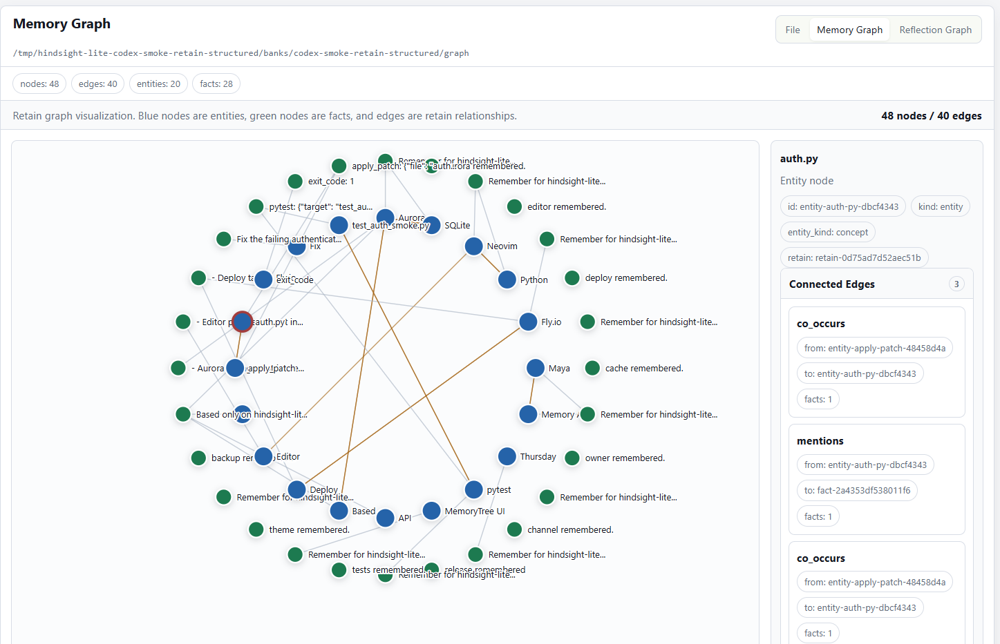

# Memory Graph

The Memory Graph is the visual inspection layer for retain-derived knowledge.
It is not a separate memory source. It renders the nodes and edges written by
Retain so you can inspect what the local bank believes was extracted from a
session.



## Retain Write Path

Hindsight's Retain model treats memory as more than saved text. A retain call
keeps the original source and extracts structured knowledge from it:

1. **Preserve source evidence.** The original conversation or document remains
   available so every structured memory can be traced back to what was said.
2. **Extract rich facts.** The write path should keep not only literal facts,
   but also useful meaning: reason, emotion, significance, and temporal clues.
3. **Classify perspective.** Facts split into `world` facts about users,
   projects, people, systems, or events, and `experience` facts about the
   agent's own actions or observations.
4. **Identify entities.** People, organizations, projects, products, tools, and
   concepts become stable graph nodes.
5. **Build connections.** Facts and entities are linked through mentions,
   co-occurrence, causal relationships, and eventually temporal or semantic
   relationships.
6. **Ground time twice.** A fact may have an occurrence time, plus the time it
   was mentioned to the agent.
7. **Prepare observations.** Facts can later consolidate into durable
   observations backed by evidence. In hindsight-lite this is intentionally a
   candidate artifact, not hosted background consolidation.

The upstream Hindsight Retain guide describes this richer model in detail:
<https://hindsight.vectorize.io/developer/retain>.

## Local hindsight-lite Mapping

hindsight-lite keeps the same mental model, but stores the write path as local
files instead of a hosted memory service:

```text
sessions/*.jsonl
  raw source evidence from Codex

retains/<session-id>.json
  retain operation envelope with facts, entities, relationships, security
  events, extraction mode, mission, and source event id

facts/<session-id>.jsonl
  first-class retained facts, one JSON object per line

entities/entities.json
  merged entity registry

graph/nodes.jsonl
  graph nodes for facts and entities

graph/edges.jsonl
  graph edges connecting nodes

observations/candidates/*.json
  reviewable evidence-backed candidates, not finalized observations
```

This gives each layer a clear responsibility:

| Layer | Purpose |
|---|---|
| `sessions` | Evidence. This is the source transcript, not a summary. |
| `retains` | Extraction envelope. This explains what Retain produced from one source event. |
| `facts` | Searchable memory units. These are the world/experience facts Recall can later use directly. |
| `entities` | Name and concept registry. This supports "what do we know about X?" style recall. |
| `graph` | Connected memory. Nodes are facts/entities; edges record relationships between them. |
| `observations/candidates` | Consolidation input. These need later review or a consolidation step. |

## Node Model

`graph/nodes.jsonl` contains one JSON object per node.

Entity node:

```json
{
  "type": "retain_graph_node",
  "id": "entity-alice-...",
  "kind": "entity",
  "label": "Alice",
  "entity_kind": "person",
  "retain_id": "retain-..."
}
```

Fact node:

```json
{
  "type": "retain_graph_node",
  "id": "fact-...",
  "kind": "fact",
  "label": "Alice joined Google last spring.",
  "fact_kind": "world",
  "retain_id": "retain-..."
}
```

## Edge Model

`graph/edges.jsonl` contains one JSON object per relationship.

```json
{
  "type": "retain_graph_edge",
  "id": "rel-...",
  "source_id": "entity-alice-...",
  "target_id": "fact-...",
  "kind": "mentions",
  "retain_id": "retain-...",
  "fact_ids": ["fact-..."]
}
```

Current edge kinds:

- `mentions`: an entity appears in a fact.
- `co_occurs`: two entities appear in the same fact.
- `causes`: a fact contains a local causal cue such as "because" or "due to".
- `temporal_near`: reserved for future temporal proximity links.
- `semantic_related`: reserved for future meaning links.

## Visual Inspection

The MemoryTree UI has a dedicated **Memory Graph** tab:

- blue nodes are entities;
- green nodes are facts;
- red edges highlight causal links;
- clicking a node shows its ID, kind, retain id, and connected edges.

The graph is deliberately simple and deterministic. It is meant to answer:

- Did Retain extract the fact I expected?
- Which entities did that fact connect to?
- Did the causal or co-occurrence edge get written?
- Is a bad extraction isolated to one retain record or repeated across
  sessions?

The **Reflection Graph** tab is separate. It visualizes failure/correction
trajectories from `reflections/*.json`; it does not render the retain knowledge
graph.

## Current Limits

hindsight-lite does not yet implement hosted Hindsight's full retain pipeline:

- no LLM fact normalization;
- no semantic embedding links;
- no robust entity disambiguation;
- no asynchronous hosted observation consolidation;
- no graph-based recall over these edges yet.

The point of the local graph is to make the write path inspectable first. Once
the graph is trustworthy, Recall can start using `facts`, `entities`, and
`graph` as first-class retrieval inputs.
